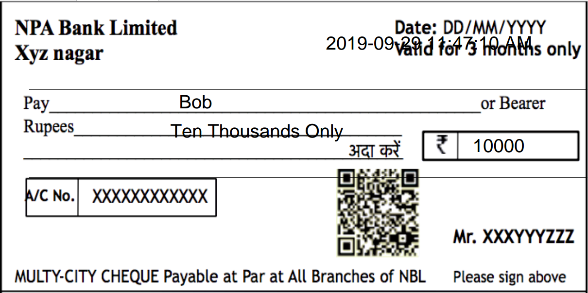

# Blockchain Oriented Cheque Settlement

## Main Flask app (Service - 1) 

### Sender and Receiver communication

1. Go to our website [BOCS Demo](http://localhost:5000/signup) and create two accounts in different browser windows.
2. Now in first account (assume sender), complete the [login](http://localhost:5000/login) and then you will see some empty cheques present in the dashboard, fill the receiver name properly (same as the one signed up).
3. Enter all the other details which are asked and then click on send to receiver. (for now enter any value in decryption key)
4. Open the receiver account and there will a cheque shown in the Receiver Cheques section. 
5. Click on send to bank to send the cheque to bank for processing :moneybag:

### Banking

Below are the steps to be followed be the bankers.

1. Visit the [Banker's Dashboard](http://localhost:5000/dashboard).
2. Click on Pending Cheques to clear the cheques on queue.
3. Enter the decryption key as **default** for now. In future, it will be the key scanned by the unique QR code from the cheque.
4. Click on ScanQR button and it will be again redirected to same page after verification.
5. Now submit the cheque.
6. Go to the [OTP Page](http://localhost:5000/otp) and enter the otp which comes in the right side of [Dashboard](http://localhost:5000/dashboard) without refreshing the page.
7. You can see the transaction result in the dashboard.
8. The transaction will be pushed to Blockchain.

#### <a href="https://bocsdemo.pythonanywhere.com" >Check the deployed webapp</a> 

## Running the source code

First install all the required Python libraries

```shell
$ pip install -r requirements.txt
```

Then run the app by

```shell
$ python flask_app.py
```

Access the app by

```
localhost/signup
localhost/login
localhost/dashboard
localhost/otp
```

## Digital Cheque (Service - 2)

Additionally, there is code which converts form to a digital cheque.

### Run digital cheque demo

Start XAMPP Server and move the "digi_cheque" folder in htdocs.

Run ```form.php```

The cheque PDF will be generated one like below.



The cheque can be further committed further to secure file Blockchain systems such as IPFS :money_with_wings:.

## Add the transaction to Blockchain (Service - 3)

- Go to folder otp_dapp
- `npm install -g truffle`
- `truffle unbox react`
- Created a basic Dapp, something more interactive than the one out of the box.
  - We added a form and a button to set the storage value using the minimalistic "storage" smart contract included in the Truffle React Box.
  - This additional code is in `src/App.js`.
- Install Moesif using standard Browser integration.
  - Leverages the [moesif-browser-js](https://www.moesif.com/docs/client-integration/browser-js/) library.
  - In `index.html` under `/public`, we added the following code snippet, between the `head` tags.

```
    <script src="//unpkg.com/moesif-browser-js@1.2.0/moesif.min.js"></script>
    <script type="text/javascript">
    var options = {
      applicationId: 'Your application id'
      // add other option here.
    };

    // for options see below.
    moesif.init(options);

    // this starts the capturing of the data.
    moesif.start();
    </script>
```

### To run this example

- Fork or download this repo.
- Get a [Moesif account by sign up](https://www.moesif.com), and obtain an Application Id.
- Edit the `index.html` file in `/public`, and replace `Your application id` with your actual application id.
- If you haven't already, install truffle by: `npm install -g truffle`
- Install dependencies for this repo: `npm install`
- Start the truffle development environment: `truffle develop`
- Compile the smart contracts: type in `compile` in the truffle develop command line prompt.
- Deploy the smart contracts: type in `migrate` in the truffle develop command line prompt.
- Start the Dapp: in another terminal, run `npm run start`.

Now, you can type go to: http://localhost:3000/, and interact with the Dapp.
As you interact with the Dapp, all the JSON-RPC calls will be captured in your
Moesif account.

### Moesif Application Id
Your Moesif Application Id can be found in the [_Moesif Portal_](https://www.moesif.com/).
After signing up for a Moesif account, your Moesif Application Id will be displayed during the onboarding steps. 

You can always find your Moesif Application Id at any time by logging 
into the [_Moesif Portal_](https://www.moesif.com/), click on the top right menu,
and then clicking _Installation_.

### Note for Metamask or use another Network.

First of all, please disable Metamask if you want this example to work out of the box.
If you need to use meta mask, you have to do few things.

- Decide on which network that you want your Metamask to connect to.
- Take a look at `truffle-config.js`, and copy that over to `truffle.js`, and add the correct settings for the the network you plan to use.
- Make sure you compile and migrate your contracts to the correct network you are using.
- On the UI side, if you are using Metamask or something, make sure it is also connected to the same network.
- Metamask intercepts every transaction and requires user to explicit first. Sometimes the popup prompt is hidden, so be sure click on the Metamask popup and accept the prompt.

### Summary

For any Dapp build on top of Ethereum and JSON-RPC using web3.js, it is very simple
to install Moesif API analytics and monitoring. The process is the same as for any normal browser based app.
Moesif automatically detects they are JSON-RPC calls and apply same level of intelligent monitoring and deep insights that we already do for other APIs such as REST or GraphQl.

### More info

Please check the [tutorial blog post related to this repo](https://www.moesif.com/blog/blockchain/ethereum/Tutorial-for-building-Ethereum-Dapp-with-Integrated-Error-Monitoring/).

## OTP Generation and QR Storage on Google Cloud

QR Generation takes time to run of Python, hence there as an asynchronous nodeJS service which generates and uploads all the files on Google Cloud Storage. 

Steps to run this service:

- Go to folder qr_generation
- `npm install`
- Create an account on Google cloud and download Application Credentials in file 'key.json'.
- Change the values about Google cloud in server.js file
- `node server.js`
- In flask_app.py, in the pending function, change the url to 'localhost:3001/url' in request() function.