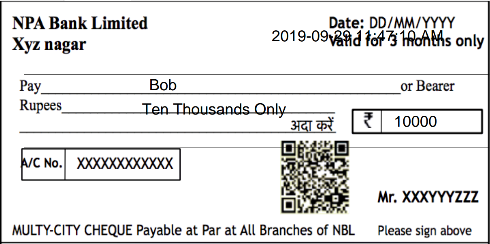

# Blockchain Oriented Cheque Settlement

## Follow steps to check our online demo

### Sender and Receiver communication

1. Go to our website [BOCS Demo](https://bocsdemo.pythonanywhere.com/signup) and create two accounts in different browser windows.
2. Now in first account (assume sender), complete the [login](https://bocsdemo.pythonanywhere.com/login) and then you will see some empty cheques present in the dashboard, fill the receiver name properly (same as the one signed up).
3. Enter all the other details which are asked and then click on send to receiver. (for now enter any value in decryption key)
4. Open the receiver account and there will a cheque shown in the Receiver Cheques section. 
5. Click on send to bank to send the cheque to bank for processing :moneybag:

### Banking

Below are the steps to be followed be the bankers.

1. Visit the [Banker's Dashboard](https://bocsdemo.pythonanywhere.com/dashboard).
2. Click on Pending Cheques to clear the cheques on queue.
3. Enter the decryption key as **default** for now. In future, it will be the key scanned by the unique QR code from the cheque.
4. Click on ScanQR button and it will be again redirected to same page after verification.
5. Now submit the cheque.
6. Go to the [OTP Page](https://bocsdemo.pythonanywhere.com/otp) and enter the otp which comes in the right side of [Dashboard](https://bocsdemo.pythonanywhere.com/dashboard) without refreshing the page.
7. You can see the transaction result in the dashboard.
8. The transaction will be pushed to Blockchain.

## Running the source code

First install all the required Python libraries

```shell
$ pip install -r requirements.txt
```

Then run the app by

```shell
$ python flask_app.py
```

Access the app by

```
localhost/signup
localhost/login
localhost/dashboard
localhost/otp
```

## Digital Cheque

Additionally, there is code which converts form to a digital cheque.

### Run digital cheque demo

Start XAMPP Server and move the "digi_cheque" folder in htdocs.

Run ```form.php```

The cheque PDF will be generated one like below.



The cheque can be further committed further to secure file Blockchain systems such as IPFS :money_with_wings:.
